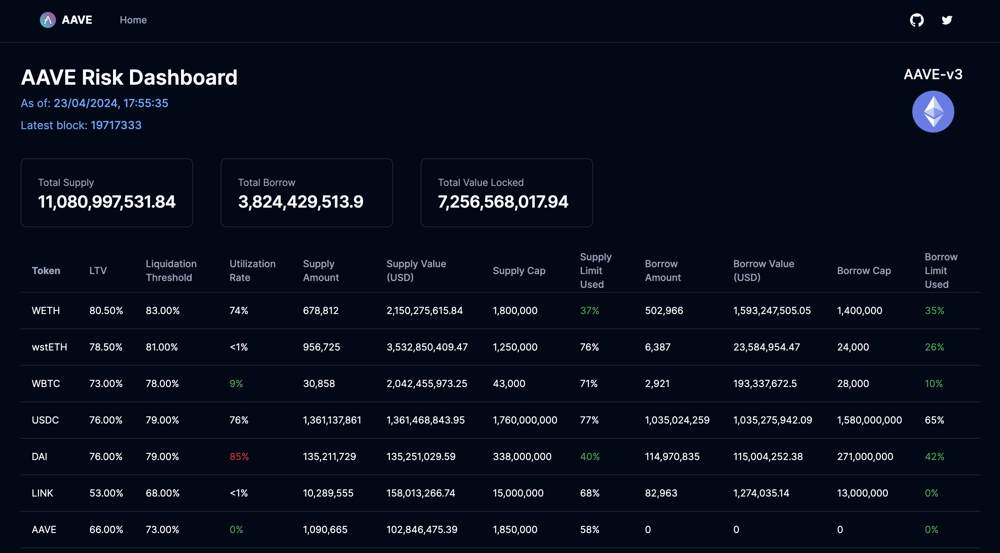

# AAVE Risk Dashboard

## Overview
This project is a comprehensive tool designed to analyze and monitor the risk associated with AAVE V3 deployed on the Ethereum blockchain. This dashboard provides real-time insights into total borrowed amounts, total supplied, and other vital health metrics to assess the solvency and overall risk of the protocol.

## Features
- **Real-time Analysis**: Monitor AAVE V3 metrics in real-time to assess ongoing risk.
- **Health Metrics**: Utilize various indicators including total supply and borrow rates to gauge protocol health.




## Project Structure
The project is organized into two main directories:
- **frontend**: Contains all the frontend code built with Next.js, responsible for rendering the user interface.
- **backend**: Houses the server-side logic written in Express that interacts with the Ethereum blockchain to fetch and process data.

## Getting Started

### Installation

1. Clone the repository:
   ```bash
   git clone https://github.com/rilwan99/aave-risk-dashboard.git
   ```
2. Navigate to the frontend/ backend directory:
   ```bash
   cd frontend
   cd backend
   ```
3. Follow the installation instructions in the [Backend README](/backend/README.md) and [Frontend README](/frontend/README.md) to set up the respective components.


### Prerequisites
You will need Node.js and npm installed on your computer to run this project. Install them from [Node.js website](https://nodejs.org/).

### Installing
Follow these steps to set up your development environment: